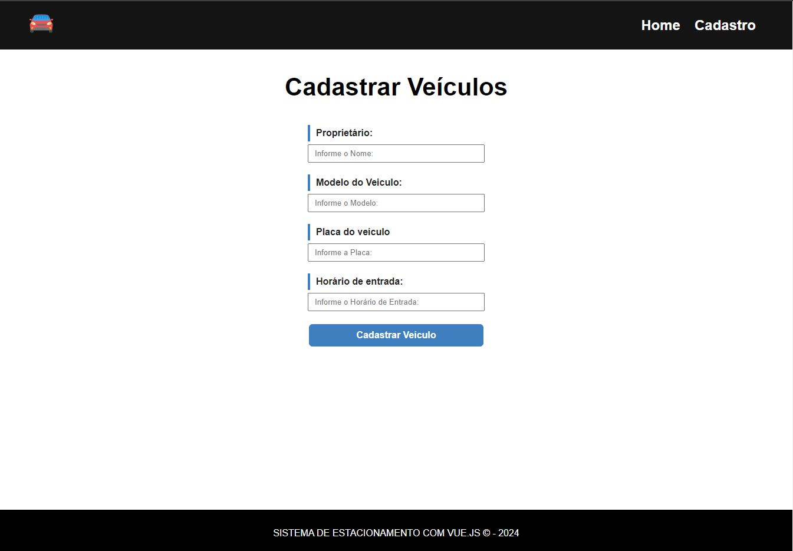
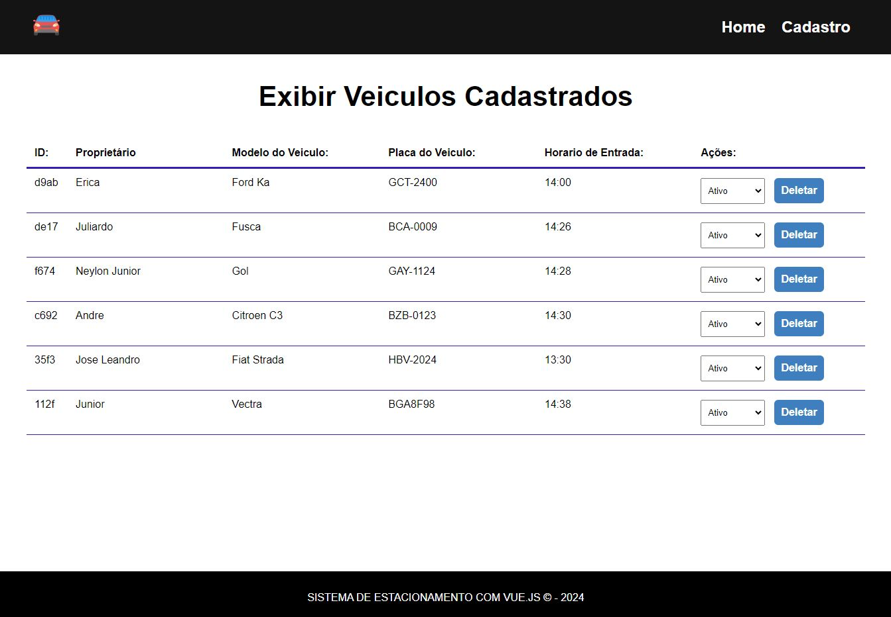

# APLICAÇÃO PARA CADASTRO E EXCLUSÃO DE VEÍCULOS

### Para utilizar, siga o passos abaixo:

## Instalar Node JS
```
npm install node
```

## Instalar Vue JS
```
npm install vue
```

### Rodar o Projeto
```
npm run dev
```

### Rodar o JSON Server
```
npm run backend
```


### Telas do Projeto


###
